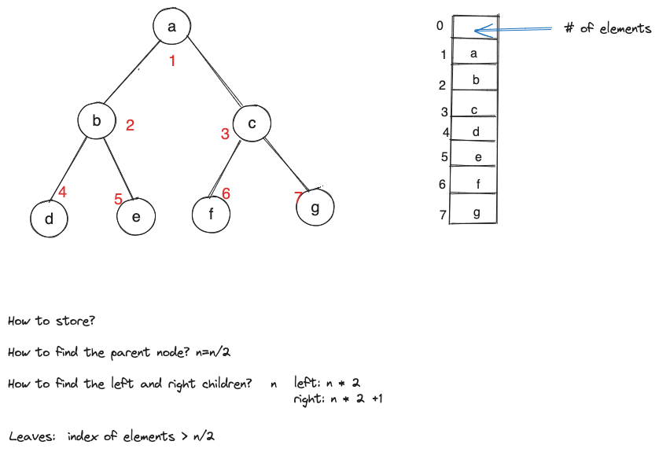

<!-- truncate -->

### Min Heap
1. Complete binary tree
2. Each node in the Heap has a value no larger than its child nodes. Therefore, the top element (root node) has the smallest value in the Heap.
<br/>
transform a binary tree into an array



```js
// Implementing "Min Heap"
public class MinHeap {
    // Create a complete binary tree using an array
    // Then use the binary tree to construct a Heap
    int[] minHeap;
    // the number of elements is needed when instantiating an array
    // heapSize records the size of the array
    int heapSize;
    // realSize records the number of elements in the Heap
    int realSize = 0;

    public MinHeap(int heapSize) {
        this.heapSize = heapSize;
        minHeap = new int[heapSize + 1];
        // To better track the indices of the binary tree, 
        // we will not use the 0-th element in the array
        // You can fill it with any value
        minHeap[0] = 0;
    }

    // Function to add an element
    public void add(int element) {
        realSize++;
        // If the number of elements in the Heap exceeds the preset heapSize
        // print "Added too many elements" and return
        if (realSize > heapSize) {
            System.out.println("Added too many elements!");
            realSize--;
            return;
        }
        // Add the element into the array
        minHeap[realSize] = element;
        // Index of the newly added element
        int index = realSize;
        // Parent node of the newly added element
        // Note if we use an array to represent the complete binary tree
        // and store the root node at index 1
        // index of the parent node of any node is [index of the node / 2]
        // index of the left child node is [index of the node * 2]
        // index of the right child node is [index of the node * 2 + 1]
        int parent = index / 2;
        // If the newly added element is smaller than its parent node,
        // its value will be exchanged with that of the parent node 
        while ( minHeap[index] < minHeap[parent] && index > 1 ) {
            int temp = minHeap[index];
            minHeap[index] = minHeap[parent];
            minHeap[parent] = temp;
            index = parent;
            parent = index / 2;
        }
    }

    // Get the top element of the Heap
    public int peek() {
        return minHeap[1];
    }

    // Delete the top element of the Heap
    public int pop() {
        // If the number of elements in the current Heap is 0,
        // print "Don't have any elements" and return a default value
        if (realSize < 1) {
            System.out.println("Don't have any element!");
            return Integer.MAX_VALUE;
        } else {
            // When there are still elements in the Heap
            // realSize >= 1
            int removeElement = minHeap[1];
            // Put the last element in the Heap to the top of Heap
            minHeap[1] = minHeap[realSize];
            realSize--;
            int index = 1;
            // When the deleted element is not a leaf node
            while (index <= realSize / 2) {
                // the left child of the deleted element
                int left = index * 2;
                // the right child of the deleted element
                int right = (index * 2) + 1;
                // If the deleted element is larger than the left or right child
                // its value needs to be exchanged with the smaller value
                // of the left and right child
                if (minHeap[index] > minHeap[left] || minHeap[index] > minHeap[right]) {
                    if (minHeap[left] < minHeap[right]) {
                        int temp = minHeap[left];
                        minHeap[left] = minHeap[index];
                        minHeap[index] = temp;
                        index = left;
                    } else {
                        // maxHeap[left] >= maxHeap[right]
                        int temp = minHeap[right];
                        minHeap[right] = minHeap[index];
                        minHeap[index] = temp;
                        index = right;
                    }
                } else {
                    break;
                }
            }
            return removeElement;
        } 
    }

    // return the number of elements in the Heap
    public int size() {
        return realSize;
    }

    public String toString() {
        if (realSize == 0) {
            return "No element!";
        } else {
            StringBuilder sb = new StringBuilder();
            sb.append('[');
            for (int i = 1; i <= realSize; i++) {
                sb.append(minHeap[i]);
                sb.append(',');
            }
            sb.deleteCharAt(sb.length() - 1);
            sb.append(']');
            return sb.toString();
        }
    }

    public static void main(String[] args) {
        // Test case
        MinHeap minHeap = new MinHeap(3);
        minHeap.add(3);
        minHeap.add(1);
        minHeap.add(2);
        // [1,3,2]
        System.out.println(minHeap.toString());
        // 1
        System.out.println(minHeap.peek());
        // 1
        System.out.println(minHeap.pop());
        // [2, 3]
        System.out.println(minHeap.toString());
        minHeap.add(4);
        // Add too many elements
        minHeap.add(5);
        // [2,3,4]
        System.out.println(minHeap.toString());
    }
}

```
