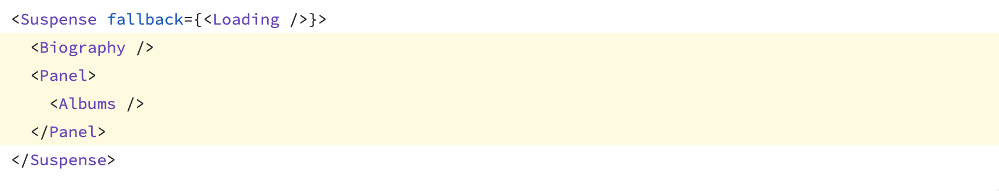
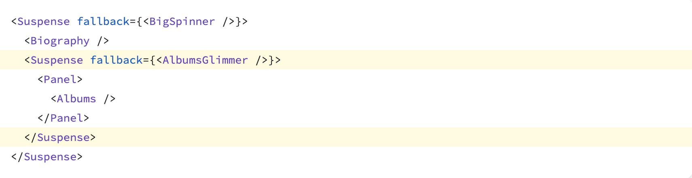

import Highlight from '@site/src/components/Highlight';
import Tabs from '@theme/Tabs';
import TabItem from '@theme/TabItem';

---
slug: react-suspense
title:  react Suspense
tags: [React]
---
<Tabs>
    <TabItem value="apple" label="apple" default>
        hello apple
    </TabItem>

    <TabItem value="orange" label="orange" default>
        hello orange
    </TabItem>
</Tabs>


# \<Suspense\>
 
\<Suspense\> component is part of *React's* Concurrent Mode feature to improve the user experience by making it more respective and resilient.


<!-- truncate -->

## Purpose
The primary purpose of the \<Suspense\> component is to handle asynchronous operations, such as data fetching or lazy loading of components, in a more declarative way. It allows you to "suspend" rendering until some condition is met, typically until data is ready.


```js
import React, { Suspense } from 'react';

const MyComponent = React.lazy(() => import('./MyComponent'));

function App() {
  return (
    <Suspense fallback={<div>Loading...</div>}>
      <MyComponent />
    </Suspense>
  );
}

```
:::tip
When you are using Relay's <Highlight style="color: #277B9F">useLazyQuery</Highlight> , the official document recommend wrap it with a <Highlight style="color: #277B9F">Suspense</Highlight> Component for better user experience.
:::

## Common usage
### Displaying a fallback while content is loading
```js
<Suspense fallback={<Loading />}>
  <Albums />
</Suspense>
```
React will display <Highlight color="#E6F8FF">loading fallback</Highlight>
until all the code and data needed by the children has been loaded.

Only Suspense-enable data sources will activate the <Highlight color=" #E6F8FF">Suspense component</Highlight>. 
1. Data fetching with Suspense-enabled frameworks like <Highlight color="#277B9F">Relay</Highlight> and <Highlight color="#277B9F">Next.js</Highlight>, such as <Highlight color="#FDF2EA">useLazyQuery</Highlight> in <Highlight color="#277B9F">Relay</Highlight> 
2. Lazy-loading component code with <Highlight color="#277B9F">lazy</Highlight> 
3. Reading the value of a Promise with <Highlight color="#277B9F">use</Highlight> 

### Revealing content together at once
By default, the whole tree inside Suspense is treated as a single unit. Only all components inside the Suspense have been ready for rendering, all of those components will appear at once. Otherwise, even if only one of these components suspends waiting for some data, all of them together will be replaced by the loading indicator.




### Revealing nested content as it loads
Each Suspense boundary's fallback will be filled in as the next level of content becomes available.



With this change, displaying the <Highlight color="#F6F7F9">Biography</Highlight> doesn't need to "wait" for the <Highlight color="#F6F7F9">Albums</Highlight> to load.

<Highlight color="#F6F7F9">AlbumsGlimmer</Highlight>

Let's break it down with proper sequence:
1. If <Highlight color="#F6F7F9">Biography</Highlight> hasn't loaded yet, <Highlight color="#F6F7F9">BigSpinner</Highlight> is shown in place of the entire content area.
2. Once the <Highlight color="#F6F7F9">Biography</Highlight> finishes loadingm <Highlight color="#F6F7F9">BigSpinner</Highlight> is replaced by the content.
3. If <Highlight color="#F6F7F9">Albums</Highlight> hasn't loaded yet, <Highlight color="#F6F7F9">AlbumsGlimmer</Highlight> id shown in place of <Highlight color="#F6F7F9">Albums</Highlight> and its parent Panel.
4. Finally, once <Highlight color="#F6F7F9">Albums</Highlight> finishes loading, it replaces <Highlight color="#F6F7F9">AlbumsGlimmer</Highlight>.

### More usage see at [react \<Suspense>](https://react.dev/reference/react/Suspense)